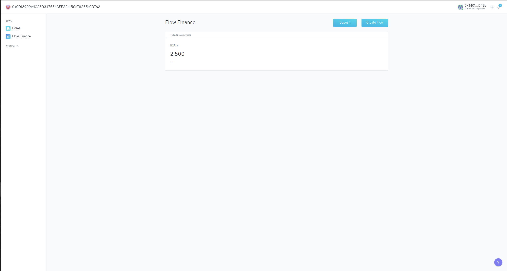
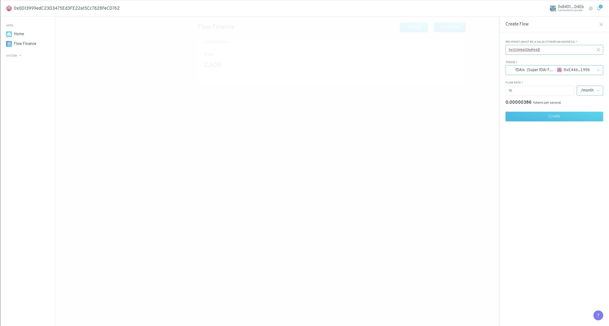

# Flow Finance

Flow Finance is an Aragon App that allows an organization to stream their funds by using Superfluid's CFA via an agent app that holds all the DAO's Super Tokens.

The Flow Finance app acts as an interface between the Agent and the Superfluid contracts, using the Agent to perform all the calls to the CFA.

#### 🐲 Project Stage: Local

The Flow Finance app hasn't been published on the APM yet.

## Gitcoin Bounty Project Report

In this section I intend to describe a bit better the process behind developing Flow Finance and the stage of the project at the moment.

### Contract Side

As mentioned earlier, the Flow Finance contract can be considered a proxy between a DAO (represented by an Agent app) and the Superfluid contracts. It encodes calls to the CFA and executes them via the Agent. That's why I intended to make the contract app design as simple as possible.

Because Aragon uses an old version of Solidity (`0.4.24`) we can't directly interact with the Superfluid framework so I had to create contract interfaces that use the same old Solidity version for every needed Superfluid contract.

I also had to use both `@1hive/hardhat-aragon` and `@aragon/buidler-aragon` as the former exposes a `publish` task to push the app to the APM (Aragon Package Manager) and the later has a `start` task that allows you to run the app smoothly locally. This requires using both `buidler` and `hardhat`.

### Front end side

The Aragon apps are sandboxed for security reasons which difficults using third party tools such as the Superfluid SDK. This complicates the way to connect with the Superfluid contracts and fetch all the required data. 
To solve this problem I decided to "go back to the old Aragon ways" and take an *event sourcing* approach on building the app's state by using the AragonAPI [`store()` method](https://hack.aragon.org/docs/api-js-ref-api#store) and set up an event loop in the background script [`script.js`](https://github.com/BlossomLabs/flow-finance/blob/main/app/src/script.js) (which is a bit similar to Redux). This way I can configurate the event loop to listen to the Superfluid's CFA contract and get all the `FlowUpdated` events needed.

One problem about this approach is that the Aragon store event loop will be listening to  ALL the CFA events and not only those where the agent has taken part of (as a receiver or a sender). This is why I had to implement the following [function](https://github.com/BlossomLabs/flow-finance/blob/053f4fb2861a67aed450d9d2e150c849966a3884/app/src/store/helpers.js?_pjax=%23js-repo-pjax-container%2C%20div%5Bitemtype%3D%22http%3A%2F%2Fschema.org%2FSoftwareSourceCode%22%5D%20main%2C%20%5Bdata-pjax-container%5D#L78) that mimics a bit the way the Aragon client does it underneath and subscribe to a contract's events  and notifies the event loop to process it. At the end of the process it will cached part of events  in the browser cache. This way I can listen to the agent events only (by passing filters) and keep using the Aragon event loop as usual.

At the end, the event loop process all the events and returns the app's state that I'll be using on the client. It has the following structure: 

```js
{
  superTokens: {
    "0xasd...": {
      address,
      balance,
      metadata: { symbol, name, decimals, underlyingTokenAddress},
      netflow,
      inFlows: {
        // sender address
        "0x23s...": { timestamp, flowRate }
      },
      outFlow: {
        // receiver address
        "0x2g6s...": { timestamp, flowRate }
      },
    },
    ...
  }
}
```

The whole event caching logic is completed. The only thing still missing is the front end development which is not completely done





I was thinknig about doing a design simliar to the Finance app user interface

## Initialization

It is initialized with:

* `_agent` The address of the agent contract that is going to hold the supertokens
* `_host_` The address of the Superfluid host contract
* `_cfa_`  The address of the **constant flow agreement** contract

## Roles

The flow finance app implements the following roles:
* **MANAGE_STREAMS_ROLE**: Necessary to create, update, and delete constant flows.
* **SET_AGENT_ROLE**: Necessary to change the agent if it's needed.

The flow finance app should have the following roles:
* **SAFE_EXECUTE_ROLE**: It should be able to execute arbitrary code from the agent that holds the supertokens.

## How to run locally

1. Clone this repo:

```sh 
git clone https://github.com/BlossomLabs/flow-finance.git

```

2. Install dependencies:

```sh
yarn

cd app/

yarn
``` 

3. Go to the root folder and run the following:

```sh
yarn start
```

This will do the following:

* Start a local ganache blockchain and set up some accounts.
* Deploy the AragonOS framework contracts.
* Deploy the Superfluid framework contracts and a couple of super tokens.
* Deploy an Aragon DAO and install on it an Agent app needed by Flow Finance.
* Deploy Flow Finance, initialize it and set up its permissions as well as the agent ones.
* Mint super tokens for the testing accounts as well as making an initial deposit to the Agent.
* Run a local Aragon Client and build and deploy the app's front end.

## How to run tests

The contract tests require running a fork network, so you'll need to set up the following env variables: 

```
HARDHAT_FORK_ID=<chain-id>
HARDHAT_FORK=<archive-node-uri>
HARDHAT_FORK_BLOCK_NUMBER=<blocknumber>
```

Once you created the `.env` file you just need to run: `yarn test`
